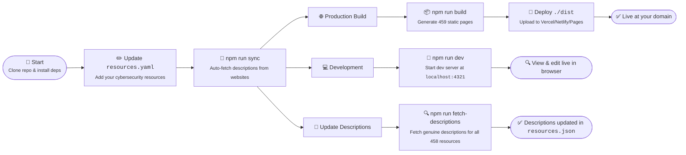

<h1 align="center">CyberHub - Cybersecurity Resource Hub</h1>
<p align="center">
<a href="https://github.com/Daniel-wambua/cyberhub"><br /></a>
<i>A modern, automated cybersecurity resource hub</i>
<br />
<i>Built with Astro, featuring 458+ curated resources with genuine descriptions</i>
<br />
<b>🌐 <a href="https://cyberhub.havocsec.tech">cyberhub.</a> | 📦 <a href="https://github.com/Daniel-wambua/cyberhub"><code>Resources</code></a></b> <br />
</p>

## Motive
CyberHub was built to eliminate one of cybersecurity’s biggest time-wasters:  
> **Finding quality, up-to-date learning and research resources.**

Instead of manually maintaining endless bookmarks or relying on outdated “awesome lists,”  
CyberHub automates the entire process — collecting, verifying, and describing hundreds of tools and platforms across cybersecurity, IT, and computer science.

This project is both a **learning accelerator** and a **proof-of-concept** in intelligent automation.

<details>
  <summary>About the Developer</summary>

> **Professional Background**<br>
> I'm a cybersecurity enthusiast and full-stack developer passionate about automation,Security, open-source tools, and building systems that work smarter, not harder. This project showcases modern web development practices combined with practical automation for the cybersecurity community.
>
> This resource hub automation reflects my philosophy: why manually maintain hundreds of descriptions when you can build intelligent systems that fetch, validate, and update them automatically? The entire pipeline is designed for maximum efficiency and genuine content accuracy.CyberHub is an experiment in that philosophy: build once, automate forever,Boom!!!!

</details>

---

## About

The entire pipeline is optimized for content accuracy and user experience, with automatic handling of failed requests and fallback descriptions to ensure professional presentation.

Why? ...Because why spend hours manually updating resource descriptions, when you could spend hours building an automated system that does it for you, obviously!

---

## Usage

<details><summary>Scripts</summary>

| Script              | Description                                                           | Usage                         |
| :------------------ | :-------------------------------------------------------------------- | :---------------------------: |
| `sync`              | Quick sync from YAML to JSON with automatic description fetching     | `npm run sync`                |
| `fetch-descriptions`| Fetch genuine descriptions for all resources from their websites      | `npm run fetch-descriptions`  |
| `build`             | Build production site with all  pages   | `npm run build`               |
| `dev`               | Start development server at localhost:4321                            | `npm run dev`                 |
| `preview`           | Preview production build locally                                      | `npm run preview`             |

</details>

---

### Option #2 - Local
See the scripts in [`package.json`](/package.json) for all available commands. Or, just run `npm run sync && npm run build` to sync resources and build the site.

1. Clone the repo
2. Update resources.yaml with your own resources
3. Run `npm install` to install dependencies
4. Run `npm run sync` to sync and fetch descriptions
5. Run `npm run build` to build the production site

Or, to run the development server:
1. Follow steps above (clone, edit, install)
2. Run `npm run dev` to start local server
3. Visit `localhost:4321` in your browser

<details><summary>Commands</summary>

- `npm install` - Install dependencies
- `npm run sync` - Sync YAML to JSON with automatic description fetching
- `npm run fetch-descriptions` - Fetch descriptions for all resources
- `npm run build` - Build production site to `./dist/`
- `npm run dev` - Start development server
- `npm run preview` - Preview production build locally
</details>



---

---

## Features

### 🌓 Dark/Light Mode
Persistent theme toggle with smooth transitions and localStorage persistence

### ⭐ Favorites System
Bookmark your favorite resources with localStorage persistence across sessions

### 📱 Mobile Friendly
Responsive design with mobile filter drawer and touch-optimized controls

### 🎯 SEO Optimized
Individual pages for each resource with Open Graph, Twitter Cards, and JSON-LD structured data.

---

## Project Structure

```
/
├── public/             # Static assets (robots.txt)
├── src/
│   ├── components/     # Astro components (ResourceCard, ThemeToggle, etc.)
│   ├── data/          # JSON data files (resources.json)
│   ├── pages/         # Page routes (index, resource/[id], sitemap.xml)
│   ├── scripts/       # Automation scripts (sync, fetch descriptions)
│   └── styles/        # Global styles (dark/light themes)
├── resources.yaml     # Main resource database (YAML)
├── check-progress.sh  # Description fetching progress checker
└── package.json       # Dependencies and scripts
```

---

## Screenshot

<h3 align="center">Desktop 🖥️</h3>
<p align="center"></p>

<h3 align="center">Mobile 📱</h3>
<p align="center"></p>

---

## Tech Stack

- **Framework**: [Astro](https://astro.build/) 5.15.4
- **Styling**: [TailwindCSS](https://tailwindcss.com/) 3.4
- **HTML Parsing**: [JSDOM](https://github.com/jsdom/jsdom) 27.1
- **Data Format**: YAML → JSON
- **Node.js**: v24.11.0 (ES Modules)
- **Deployment**: Vercel / Netlify / GitHub Pages

---

## Contributing

### Pull Requests
Feel free to fork and customize for your own use! This is a personal project, but contributions are welcome.

### Issues
Found a bug or have a suggestion? Open an issue and I'll take a look.

---

## Attribution/credits
This project was made possible by the following open-source libraries:

- [Astro](https://astro.build/)
- [TailwindCSS](https://tailwindcss.com/)
- [JSDOM](https://github.com/jsdom/jsdom)
- [node-fetch](https://github.com/node-fetch/node-fetch)
- [YAML](https://github.com/eemeli/yaml)

---

## License

> _**[CyberHub](https://github.com/Daniel-wambua/cyberhub)** is licensed under [MIT](https://github.com/Daniel-wambua/cyberhub/blob/HEAD/LICENSE) © [Havoc](https://lab.havocsec.me) 2025._<br>
> <sup align="right">For information, see <a href="https://tldrlegal.com/license/mit-license">TLDR Legal > MIT</a></sup>

<details>
<summary>Expand License</summary>

```
The MIT License (MIT)
Copyright (c) Havoc <havoc@havocsec.me>

Permission is hereby granted, free of charge, to any person obtaining a copy 
of this software and associated documentation files (the "Software"), to deal 
in the Software without restriction, including without limitation the rights 
to use, copy, modify, merge, publish, distribute, sub-license, and/or sell 
copies of the Software, and to permit persons to whom the Software is furnished 
to do so, subject to the following conditions:

The above copyright notice and this permission notice shall be included in all 
copies or substantial portions of the Software.

THE SOFTWARE IS PROVIDED "AS IS", WITHOUT WARRANTY OF ANY KIND, EXPRESS OR IMPLIED,
INCLUDING BUT NOT LIMITED TO THE WARRANTIES OF MERCHANTABILITY, FITNESS FOR A
PARTICULAR PURPOSE AND NON INFRINGEMENT. IN NO EVENT SHALL THE AUTHORS OR COPYRIGHT
HOLDERS BE LIABLE FOR ANY CLAIM, DAMAGES OR OTHER LIABILITY, WHETHER IN AN ACTION
OF CONTRACT, TORT OR OTHERWISE, ARISING FROM, OUT OF OR IN CONNECTION WITH THE
SOFTWARE OR THE USE OR OTHER DEALINGS IN THE SOFTWARE.
```

</details>

<!-- License + Copyright -->
<p align="center">
  <i>© <a href="https://lab.havocsec.me">Havoc</a> 2025</i><br>
  <i>Licensed under <a href="https://opensource.org/licenses/MIT">MIT</a></i><br>
  <a href="https://gitlab.com/richie-havoc"></a><br>
  <sup>Thanks for visiting :)</sup>
</p>

<!-- Hacker ASCII Art -->
<!-- 
    _______  __   __  _______  _______  ______    __   __  __   __  _______ 
   |       ||  | |  ||  _    ||       ||    _ |  |  | |  ||  | |  ||  _    |
   |       ||  |_|  || |_|   ||    ___||   | ||  |  |_|  ||  | |  || |_|   |
   |       ||       ||       ||   |___ |   |_||_ |       ||  |_|  ||       |
   |      _||_     _||  _   | |    ___||    __  ||       ||       ||  _   | 
   |     |_   |   |  | |_|   ||   |___ |   |  | ||   _   ||       || |_|   |
   |_______|  |___|  |_______||_______||___|  |_||__| |__||_______||_______|
-->


